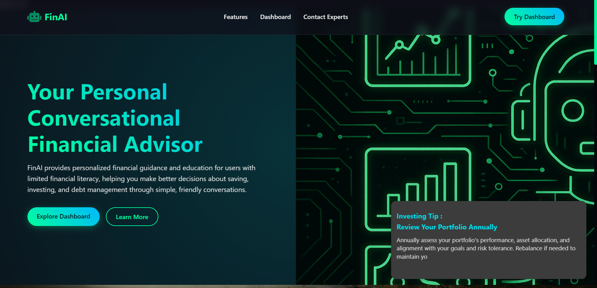
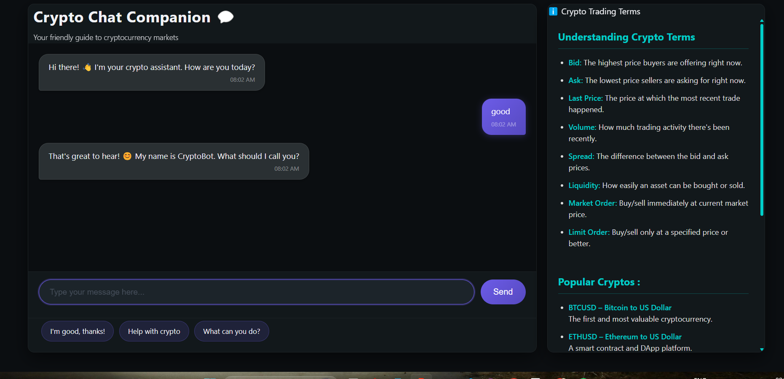
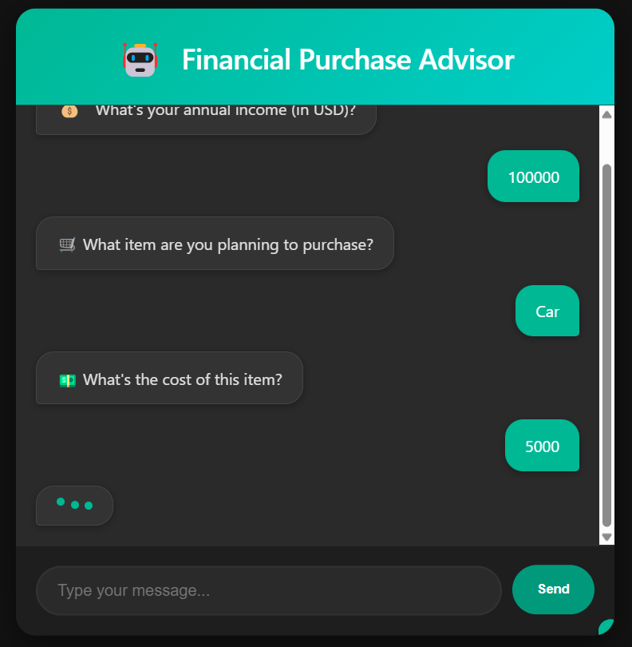
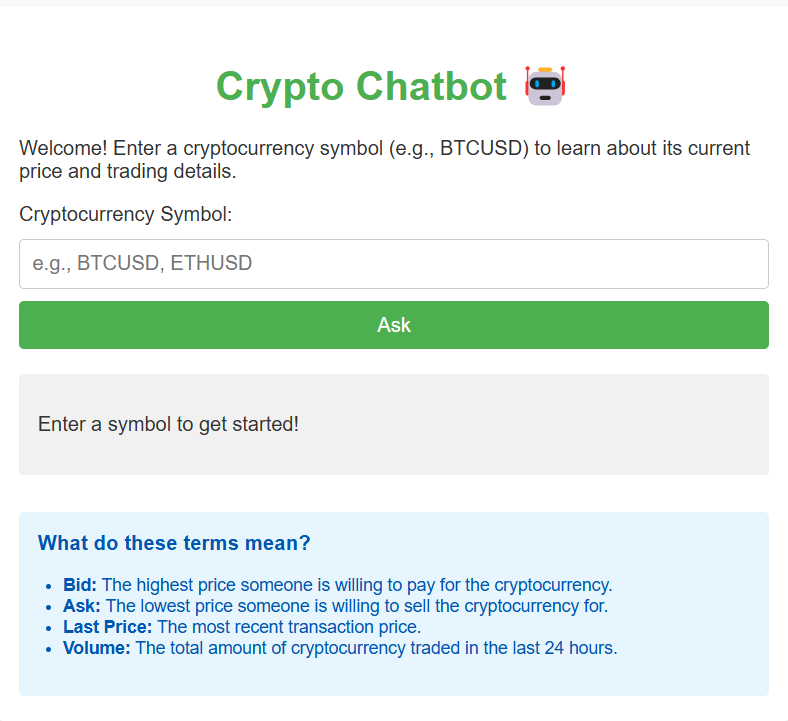
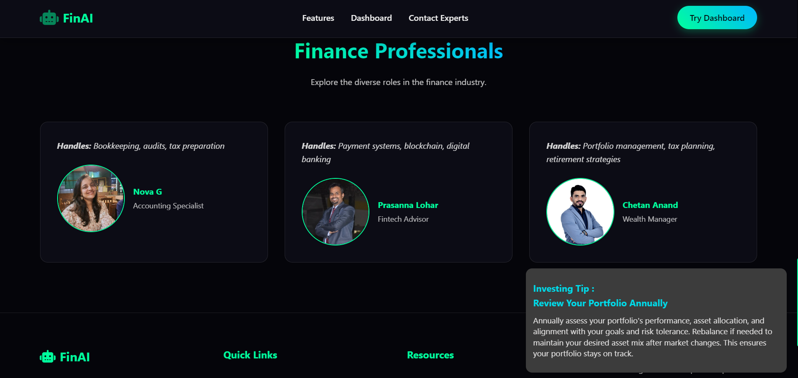
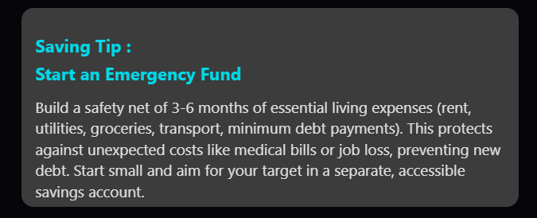

### 🤖 Conversational Financial Advisor

# The project aims to simplify financial decision-making for users with limited financial literacy. It provides tools for saving, investing, debt management, and cryptocurrency tracking. The platform integrates multiple chatbots, each specializing in a specific financial domain, to deliver tailored advice and insights. 

### 🔧 Libraries

- *HTML5*  
  Used for structuring the chatbot interface and layout.

- *CSS3*  
  Used for styling the chatbot, including animations, themes, and responsive design.

- *JavaScript (Vanilla)*  
  Used for handling user interactions, managing conversation flow, and dynamically updating the UI.

- *Fetch API*  
  Used for making HTTP requests to fetch cryptocurrency data from the backend or external APIs.

- *Node.js* 
  Used to create the backend server

- *Express.js*
  Used to define routes and managing http request 

---

### 🔌 APIs

- *Gemini API*  
  - *Endpoint*: http://localhost:3000/api/ask  
  - *Purpose*: Fetches cryptocurrency market data such as bid price, ask price, last trade price, and 24-hour volume.

---

---
## 1. Crypto Conversation Bot

**Purpose**  
Assists users in understanding cryptocurrency markets, tracking prices, and learning trading concepts.

**Features**
- Provides real-time cryptocurrency data (bid, ask, last trade price, 24-hour volume)
- Explains crypto trading terms: `bid`, `ask`, `spread`, and `liquidity`
- Offers personalized advice based on user preferences (trading, investing, learning)
- Suggests popular cryptocurrencies (e.g., BTCUSD, ETHUSD, SOLUSD)

**Prominence**
- Ideal for beginners entering the crypto space
- Helps traders and investors make informed decisions

**How It Works**
- Users interact with the bot via a chat interface
- Bot fetches data from the Gemini API and responds with insights
- Tailors answers based on user preferences and conversation flow

---

## 2. Financial Purchase Advisor

**Purpose**  
Helps users evaluate whether a purchase aligns with their budget.

**Features**
- Analyzes income and purchase cost to assess affordability
- Offers advice on whether to proceed with the purchase
- Calculates estimated monthly payments for installment options

**Prominence**
- Promotes responsible spending
- Aids users in avoiding unnecessary debt

**How It Works**
- Users input income, item details, and cost
- Bot calculates affordability and offers actionable suggestions

---

## 3. Investment Comparator Advisor

**Purpose**  
Compares different investment options to help users maximize returns.

**Features**
- Accepts investment amount, duration, and options to compare
- Projects returns based on historical average performance
- Highlights best option considering returns and risk

**Prominence**
- Simplifies investment decisions for beginners
- Promotes informed financial choices

**How It Works**
- User provides investment details
- Bot computes future values using predefined return rates and risk factors
- Results include a detailed breakdown of each option

---

## 4. Debt Manager Bot

**Purpose**  
Helps users create and manage a debt repayment plan.

**Features**
- Collects debt details: balance, interest rate, and minimum payment
- Recommends repayment strategies (e.g., Snowball Method)
- Provides repayment schedule and progress tracking

**Prominence**
- Empowers users to become debt-free faster
- Reduces stress with clear, manageable strategies

**How It Works**
- Users input details for each debt
- Bot calculates and prioritizes repayment based on chosen method
- Progress is tracked with regular updates on balances

---

## Finance Professionals Section

**Purpose**  
To inspire users by presenting real-world professionals who specialize in different areas of finance.

**Features**
- Each profile includes:
  - A brief description of their expertise.
  - A professional photo.
  - A link to their LinkedIn profile for further connection.

**Prominence**
- Builds credibility by highlighting diverse financial expertise.
- Encourages users to trust the platform's guidance.

**How It Works**
- Users view professional profiles.
- Expertise help
- Each profile links to LinkedIn for further exploration.

---

## Financial Tip Feature

**Purpose**  
- To educate users on financial topics like saving, investing, and debt management.
- To offer quick, practical tips that users can implement in their daily lives.

**Features**
- *Categories*: Tips are divided into categories such as:
  - Saving Tips
  - Investing Tips
  - Debt Management Tips
  - Mixed Tips
- *Dynamic Display*: Tips are shuffled and displayed one at a time.
- *Typewriter Animation*: Tips are shown with a typewriter effect for an engaging user experience.
- *Auto-Rotation*: Tips change automatically every 10 seconds.

**Prominence**
- Provides users with actionable advice on saving, investing, and debt management, enhancing financial literacy.
- Offers quick, easy-to-implement tips that users can apply in their daily financial decisions.
- Covers diverse financial topics, making it relevant for users at different stages of their financial journey.

---
