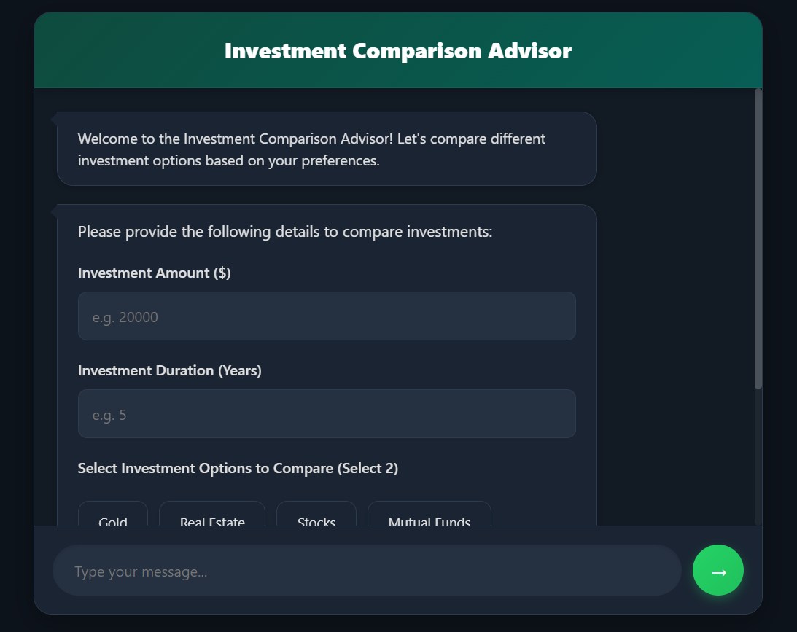
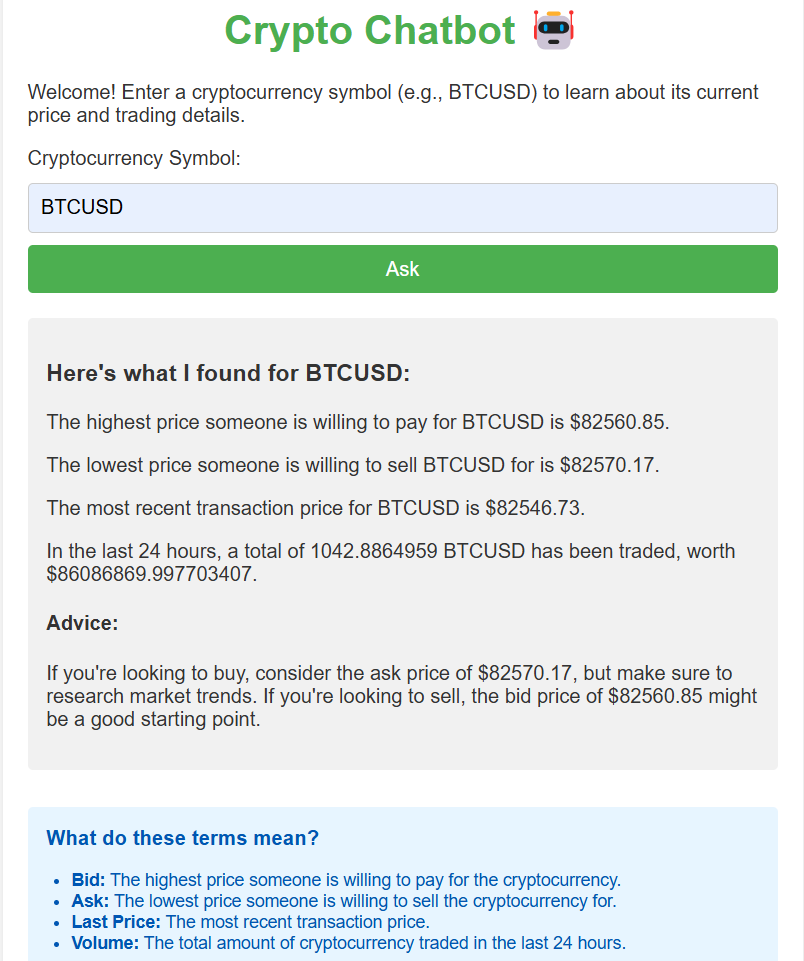

# Crypto Chatbot 🤖

A simple and user-friendly cryptocurrency chatbot designed to provide real-time cryptocurrency price information and trading advice. This project is tailored for users with limited financial literacy, offering conversational responses and educational insights.

---

## Features
- **Real-Time Cryptocurrency Data**: Fetches live data from the Gemini API.
- **Conversational Interface**: Provides responses in plain, easy-to-understand language.
- **Educational Insights**: Explains financial terms like "Bid," "Ask," and "Volume."
- **Advice for Buying and Selling**: Offers basic guidance based on market data.

---

## Technologies Used
- **Backend**: Node.js, Express.js, Axios
- **Frontend**: HTML, CSS, JavaScript
- **API**: Gemini API for cryptocurrency data

---

## Screenshots

